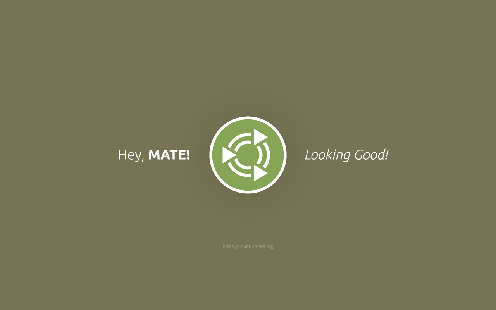
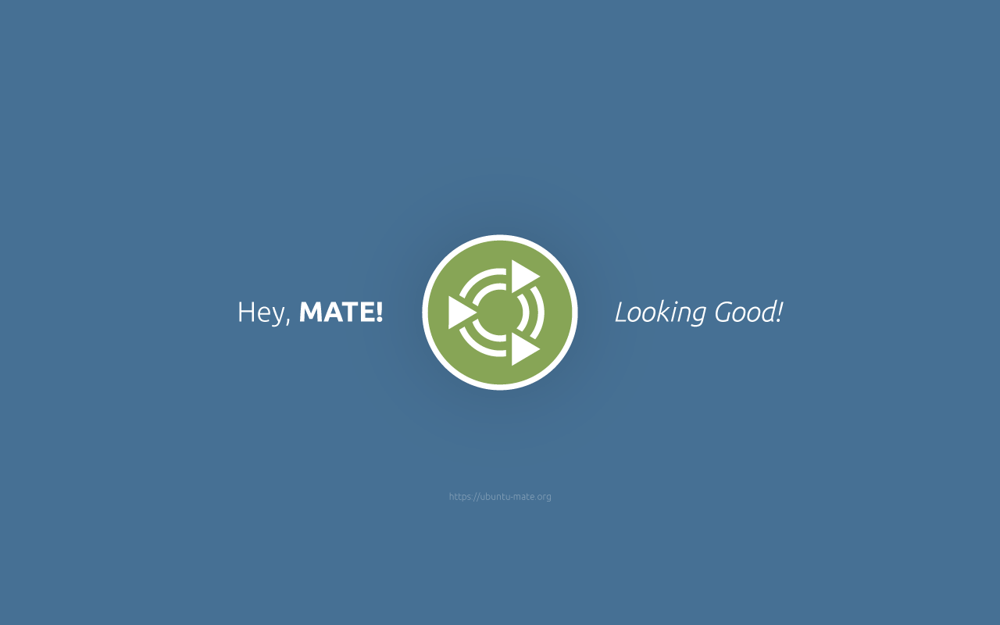
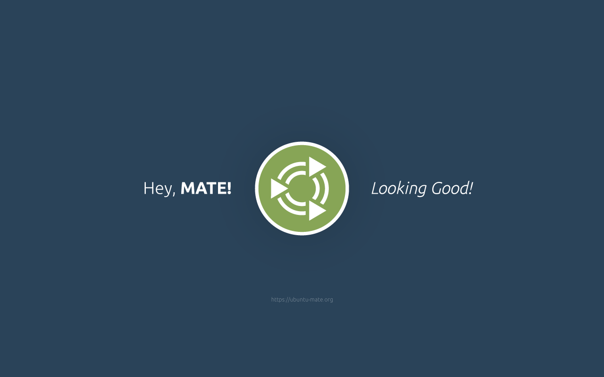
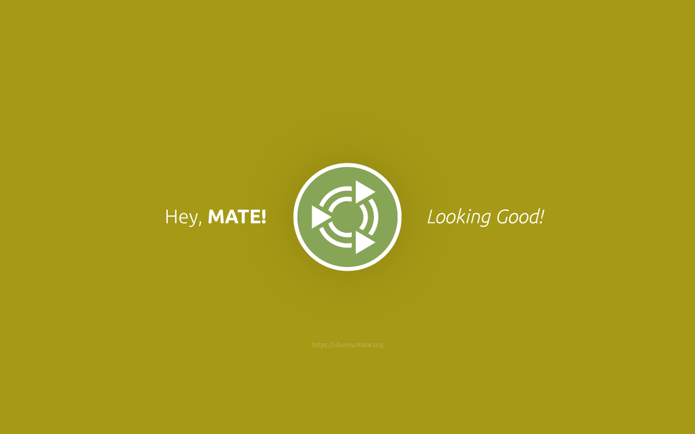
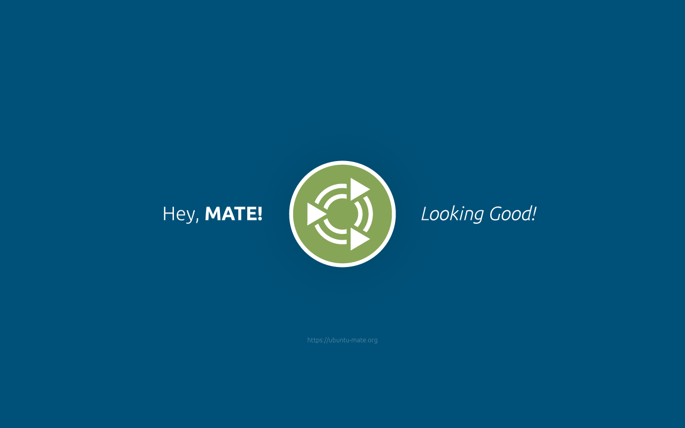

Ubuntu Mate Identity Graphics
==================================

A collection of graphics with the [Ubuntu Mate](http://ubuntu-mate.org/) logo.

Licensed under a [Creative Commons Attribution 4.0 International](https://creativecommons.org/licenses/by/4.0/) license.

